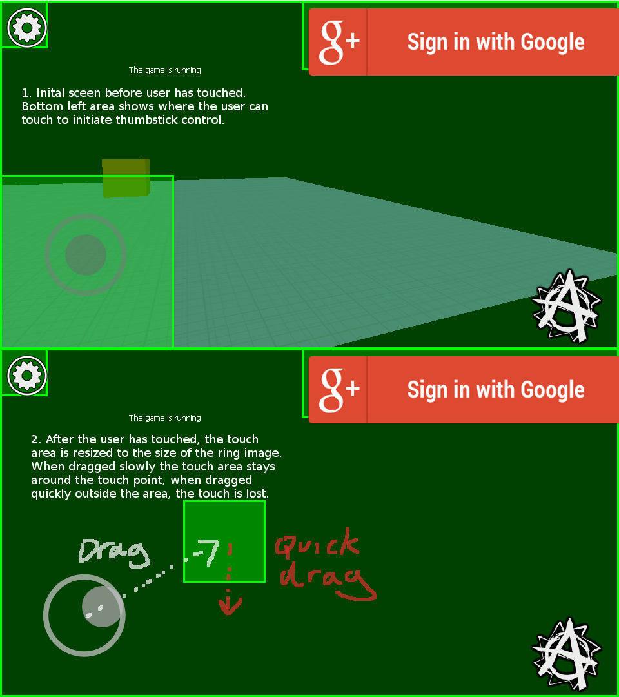

# Project Anarchy Virtual Thumb Stick Upgrade

Upgrade for the Project Anarchy `VVirtualThumbStick` C++ class to add more features. 

This class adds the following features to the class:

- **Color** - Set the active and inactive color of the thumbstick images.
- **Priority** - Set the touch area priority which was previously hardcoded to a value of -1500.
- **Right stick emulation** - Emulate a right stick or a left stick, useful if you are making a twin stick shooter.
- **After-touch area adjustment** - Allows increasing the size of the touch area that is used after the user has activated the thumbstick. This can be used if you find that the user is losing their touch without their finger leaving contact with the screen.

## Constucting the class

The class has been put into a namespace called `Rts`, this is to prevent confusion with the existing `VVirtualThumbStick` class which is part of the Anarchy SDK.

```C++

	const VRectanglef validArea = VRectanglef(0,0,200,200);
	Rts::VVirtualThumbStick* m_pVirtualThumbStickL = new Rts::VVirtualThumbStick(validArea);
```

## Image Colors

You can now set the active and inactive color of the thumbstick images using `SetActiveColor` and `SetInActiveColor`:

```C++

	//Set the active color to red, and inactive color to red with 1/4 alpha
	VColorRef Lcolor(255,0,0,255);
	m_pVirtualThumbStickL->SetActiveColor( Lcolor );
	Lcolor.a /= 4;
	m_pVirtualThumbStickL->SetInActiveColor( Lcolor );
```

The color can be changed at any point after construction.

## Touch Area Priority

You can change the priority of the touch area when constructing (previously hard-coded to -1500):

```C++

	const VRectanglef validArea = VRectanglef(0,0,200,200);
	const float priority = -1000.0f;
	Rts::VVirtualThumbStick* m_pVirtualThumbStickL = new Rts::VVirtualThumbStick(validArea, 0.5f, 0.5f, priority);
```

## Right Stick Emulation

You can emulate a right stick instead of a left stick when constructing (previously hard-coded to left thumbstick):

```C++

	const VRectanglef validArea = VRectanglef(0,0,200,200);
	const float priority = -1000.0f;
	const bool rightThumbStick = true;
	Rts::VVirtualThumbStick* m_pVirtualThumbStickR = new Rts::VVirtualThumbStick(validArea, 0.5f, 0.5f, priority, rightThumbStick);
```

## After-Touch Area Adjustment

When the user touches the screen and the virtual stick is active, the touch area is set to be the size of the "ring" image. It is possible to increase the size of this area by a factor using `SetAfterTouchSize`. Use this if you find that the stick is becoming inactive when small quick movements are made.

```C++

	//set the aftertouch area to be twice the size of the image used as the ring
	const float AFTERTOUCH_FACTOR = 2.0f;
	m_pVirtualThumbStickL->SetAfterTouchSize( AFTERTOUCH_FACTOR, AFTERTOUCH_FACTOR );
```
 

